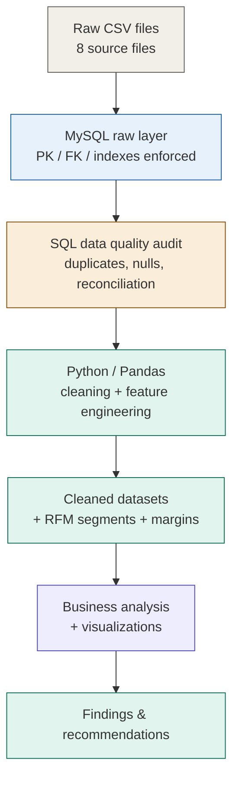
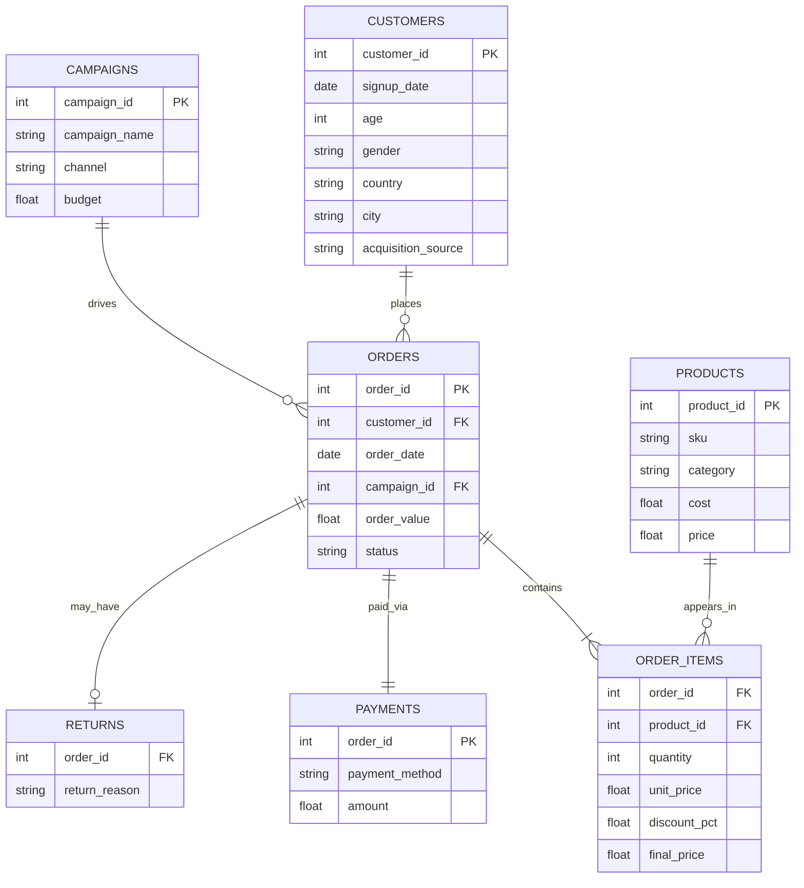
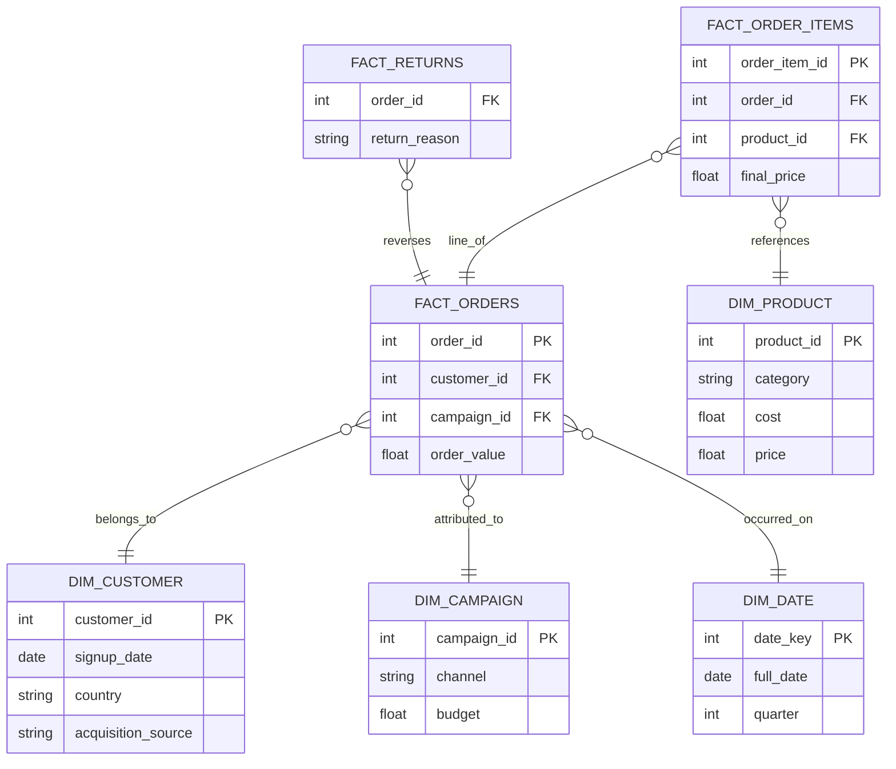
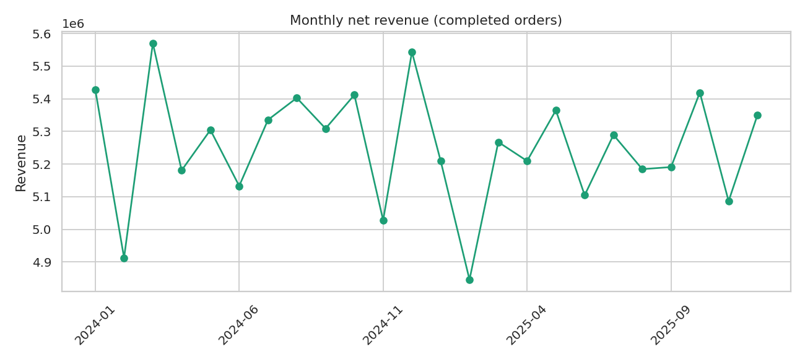
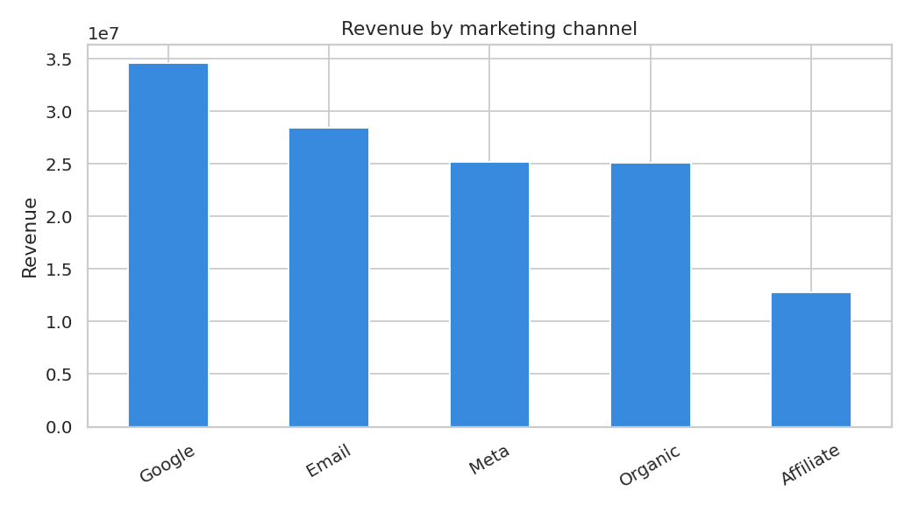
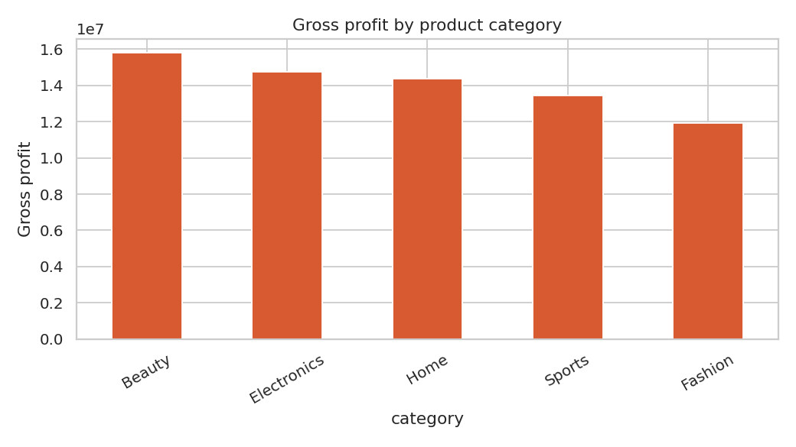
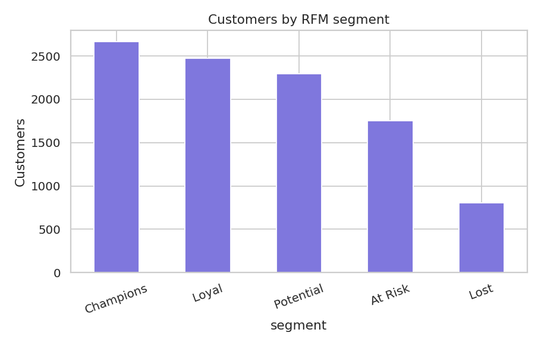
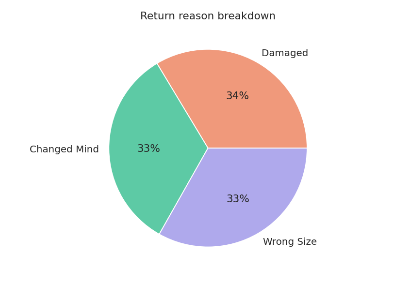

<div align="center">


<a href="https://github.com/Lifewitdata">
  
</a>

<br/>


</div>

<br/>

## Table of contents

- [Why this project is different](#why-this-project-is-different)
- [Architecture](#architecture)
- [Repository structure](#repository-structure)
- [Data model](#data-model)
- [Bugs I caught before they shipped](#bugs-i-caught-before-they-shipped)
- [Key findings](#key-findings)
- [Dashboards](#dashboards)
- [How to reproduce](#how-to-reproduce)
- [What I'd build next](#what-id-build-next)

<br/>

## Why this project is different

Most portfolio projects stop at *"load a CSV into pandas, make a chart."* This one is built the way an analyst actually works: load into a real relational database with enforced keys and constraints, run SQL-level data quality checks **before** touching Python, catch and document a real inconsistency in the source data, and only then move to Python for what SQL isn't the right tool for — feature engineering, RFM segmentation, and visualization.

> [!IMPORTANT]
> While building the category profitability numbers, every category came back with **negative profit**. That was wrong, and I didn't just round it away — I traced it to a real bug in the source data's `final_price` column (it's a per-unit price, not a line total). See [Bugs I caught before they shipped](#bugs-i-caught-before-they-shipped) below.

<br/>

## Architecture



<br/>

## Repository structure

```
Ecommerce-Growth-Analytics/
├── data/
│   ├── raw/              # original, untouched CSV exports
│   └── cleaned/          # cleaned + feature-engineered CSVs (notebook output)
├── sql/
│   ├── 01_create_raw_tables.sql   # DDL — 8 tables, PKs, FKs, indexes, rationale comments
│   ├── 02_load_raw_data.sql       # LOAD DATA INFILE, FK-safe load order
│   └── 03_business_queries.sql    # 25 business questions answered in SQL
├── notebooks/
│   └── 01_cleaning_and_analysis.ipynb   # MySQL → pandas → cleaning → features → charts
├── dashboards/            # exported chart images
├── docs/
│   ├── ER_and_star_schema.md
│   ├── business_analysis.md
│   └── resume_and_linkedin.md
├── requirements.txt
└── README.md
```

<br/>

## Data model

<details>
<summary><b>Raw source ERD</b> (click to expand)</summary>



</details>

<details>
<summary><b>Target star / galaxy schema</b> (click to expand)</summary>



</details>

Full rationale (why a galaxy schema, why `daily_kpi_snapshot` sits outside the model) is in [`docs/ER_and_star_schema.md`](docs/ER_and_star_schema.md).

<br/>

## Bugs I caught before they shipped

| # | What I found | How I caught it | Fix |
|---|---|---|---|
| 1 | 156 exact duplicate rows in `order_items` | SQL `GROUP BY ... HAVING COUNT(*) > 1` audit | `drop_duplicates()` in the cleaning notebook, before/after row count logged |
| 2 | `final_price` is a **per-unit** price, not a line total — using it directly made every category show negative profit | Sanity-checked `avg(final_price)` against `avg(unit_price) × (1 − avg(discount_pct))` — matched exactly, and was independent of quantity | Every revenue/profit calc now multiplies `final_price × quantity` |
| 3 | `daily_kpi_snapshot.csv` doesn't reconcile with revenue computed from `orders.csv` — off by roughly an order of magnitude, no consistent offset | Row-by-row diff between reported and computed daily revenue (`sql/03_business_queries.sql`, Q25) | Snapshot table treated as a lower-trust reference, not ground truth — all KPIs computed from transactional tables |

> [!WARNING]
> If you're reviewing this repo and want to test your own eye for data issues: try computing category profit using `final_price` alone (no quantity multiplier) before reading the notebook. It's a very natural mistake to make, and the dataset doesn't warn you.

<br/>

## Key findings

<div align="center">

| Metric | Value |
|---|---|
| Net revenue (completed orders) | **$126.1M** |
| Average order value | **$1,679.90** |
| Return rate | **24.95%** |
| Category gross margin | **40–43%** |
| Marketing ROAS (all channels) | **below 1.0** ⚠️ flagged, see below |

</div>

- **Returns** are split almost evenly across *Damaged* (34%), *Changed Mind* (33%), and *Wrong Size* (33%) — and flat across all 5 countries (24–25%). No single fix moves this number; it needs three parallel workstreams (packaging QA, product photography/description clarity, and a sizing tool).
- **Beauty leads on revenue, Electronics leads on margin** — a gap a revenue-only dashboard would hide.
- **Every channel's ROAS comes out under 1.0**, including "Organic," which unusually carries a non-zero budget in this dataset. Read as a data reconciliation issue (budget periods likely don't match order attribution windows), not a real marketing failure — see [`docs/business_analysis.md`](docs/business_analysis.md) for the full reasoning.

<br/>

## Dashboards

<p align="center">
  
  
</p>
<p align="center">
  
  
</p>
<p align="center">
  
</p>

<br/>

## How to reproduce

```bash
# 1. MySQL setup
mysql -u root < sql/01_create_raw_tables.sql
mysql --local-infile=1 -u root < sql/02_load_raw_data.sql
mysql -u root ecommerce_analytics < sql/03_business_queries.sql

# 2. Python environment
pip install -r requirements.txt

# 3. Run the notebook end to end
jupyter nbconvert --to notebook --execute --inplace notebooks/01_cleaning_and_analysis.ipynb
```

<br/>

## What I'd build next

- [ ] dbt models for `fact_orders` / `fact_order_items` / `dim_*` with automated tests (uniqueness, not-null, referential integrity)
- [ ] Tableau executive dashboard that reconciles against `daily_kpi_snapshot` and surfaces the discrepancy instead of hiding it
- [ ] Cohort retention curves using `signup_cohort` (already engineered in the notebook, not yet visualized)
- [ ] Category-level return rate to prioritize the three returns workstreams

<br/>

<div align="center">


**If you found the data-quality catches interesting, that's the point of the project.**
Full business writeup → [`docs/business_analysis.md`](docs/business_analysis.md) · Resume & interview prep → [`docs/resume_and_linkedin.md`](docs/resume_and_linkedin.md)

</div>
